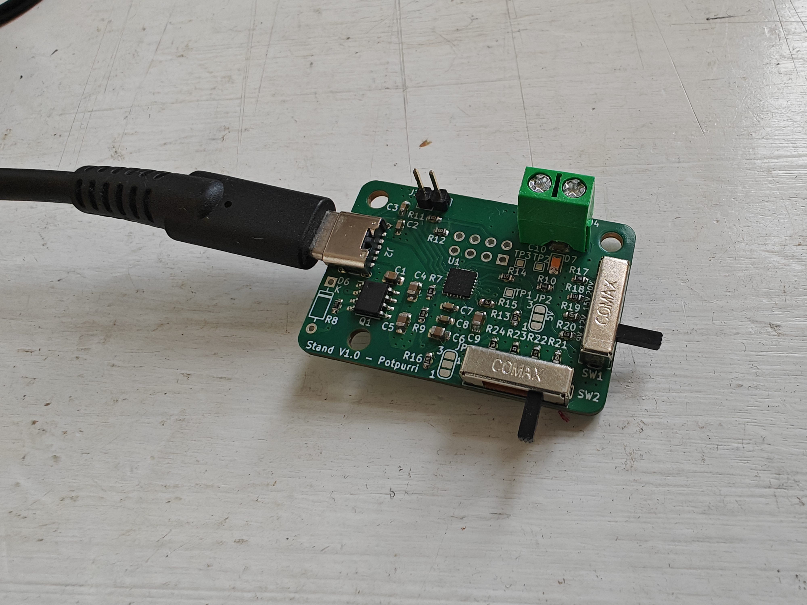
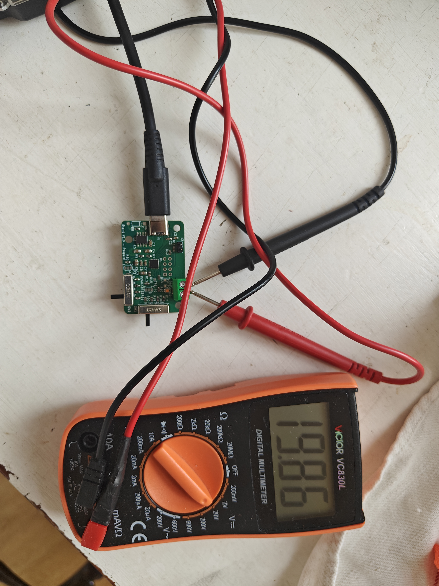
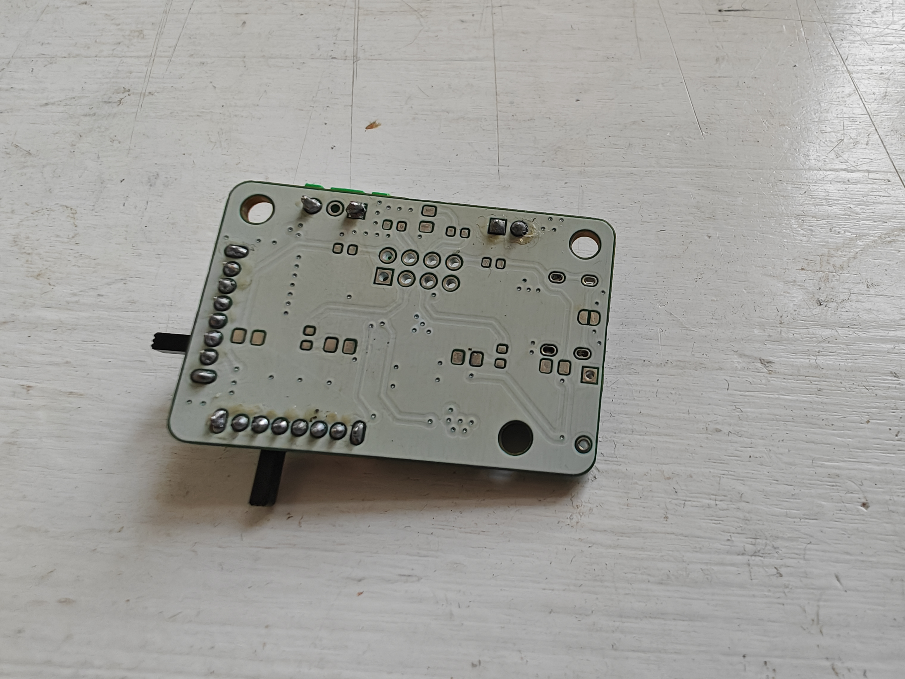
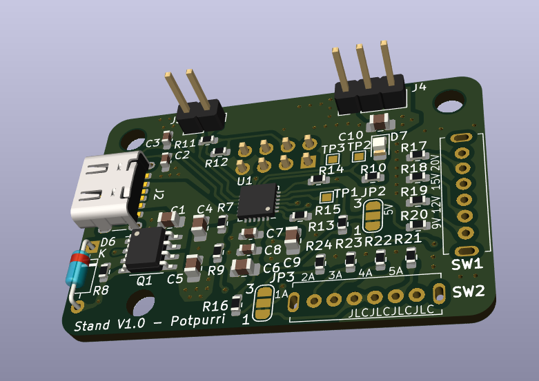

# USB Power Delivery Board (CYPD-3177) / BeerBoard-stand

**THIS IS AN OLD DESIGN, FOR VER 2 LOOK AT [THIS REPOSITORY](https://github.com/potpurri/USB-C_PD_Board_V2_CYPD3177).**

This **USB Power Delivery (PD) Board** is based around the **CYPD-3177** chipset. The board allows users to select the desired output **voltage** and **current** using onboard switches, making it ideal for powering my **breadboard projects**. [Schematic can be found here.](https://github.com/potpurri/USB-C-PD-CYPD3177-and-BeerBoard-stand/blob/f3c342192d2ab72d846928ec36ac7f8050d37a6a/imgs/Schematic.pdf)

Users can choose between the following **voltage levels**: **5V, 9V, 12V, 15V, and 20V**, and **current levels**: **1A, 2A, 3A, 4A, and 5A**, depending on the configuration and power supply capabilities.

(The underside of the board also functions as a stand for the [BeerBoard](https://github.com/potpurri/BeerBoard))

The board is soldered by me using a [Pinecil V2](https://wiki.pine64.org/wiki/Pinecil) by PINE64  and [MHP50](https://e-design.com.cn/en/Mini-Hot-Plate-Preheater-MHP50-PG9555615) by MiniWare.

## Key Features
- Based on the **CYPD-3177** USB PD controller
- User-selectable output **voltage**: **5V, 9V, 12V, 15V, and 20V**
- User-selectable output **current**: **1A, 2A, 3A, 4A, and 5A**
- Supports standard USB Power Delivery profiles for flexible power output; compact and versatile

## Images

### Assembled Images

### 3D Image

